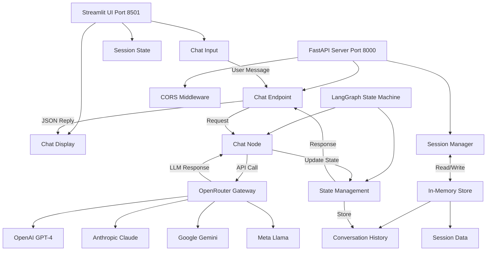
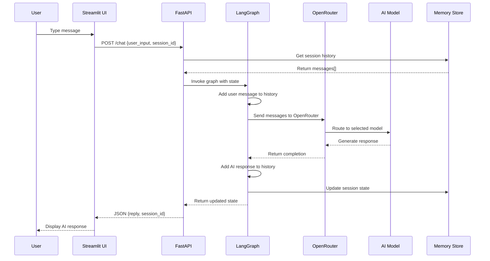
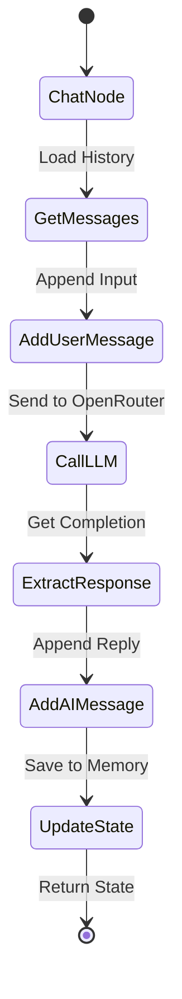
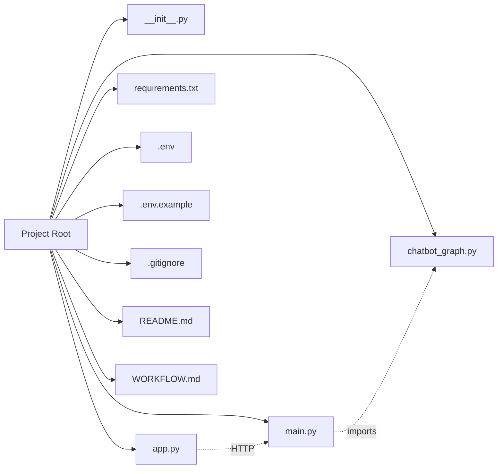
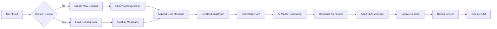
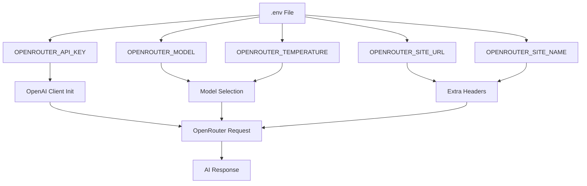
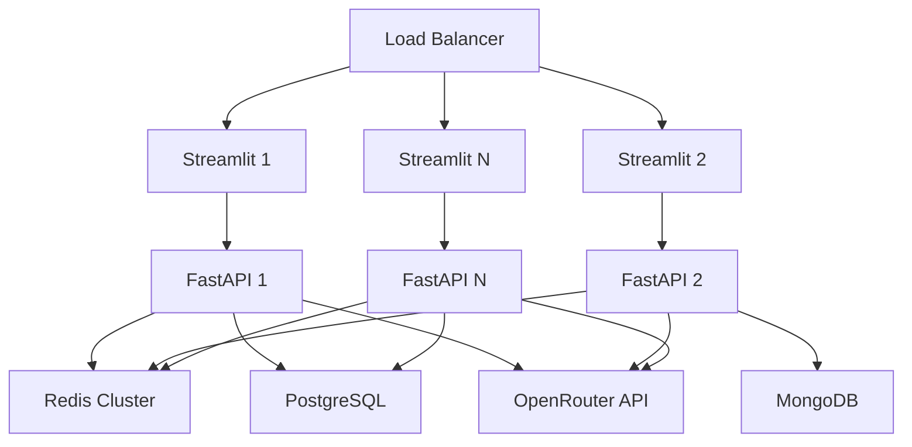
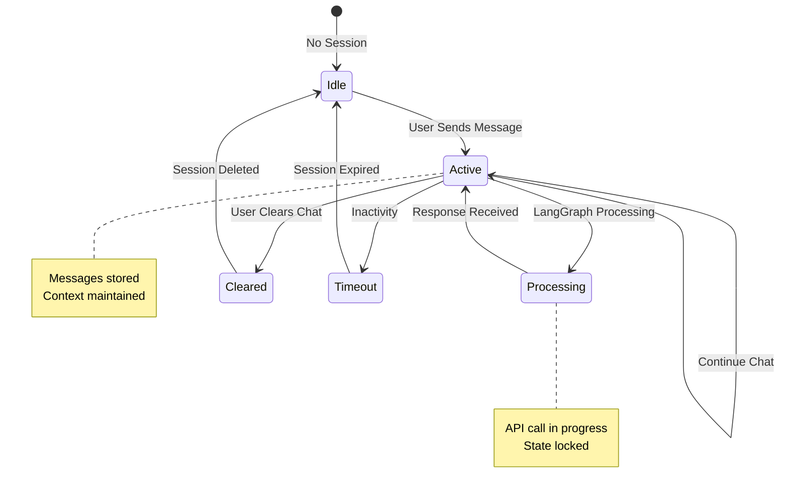

# LangGraph Chatbot - System Architecture & Workflow

## 🏗️ System Architecture Diagram



## 📊 Request Flow Diagram



## 🔄 LangGraph State Machine



## 🗂️ File Structure & Dependencies



## 🎯 Component Interaction Map

```mermaid
flowchart TD
    EXT1[FastAPI]
    EXT2[Streamlit]
    EXT3[LangGraph]
    EXT4[OpenAI SDK]
    EXT5[Pydantic]
    
    MAIN[main.py]
    GRAPH[chatbot_graph.py]
    APP[app.py]
    
    OR[OpenRouter API]
    end

    subgraph Services["External Services"]
        OR[OpenRouter API]
    end

    MAIN --> EXT1
    MAIN --> EXT5
    MAIN --> GRAPH

    GRAPH --> EXT3
    GRAPH --> EXT4
    GRAPH --> OR

    APP --> EXT2
    APP --> MAIN
```

## 📦 Data Flow



## 🔐 Environment Variables Flow



## 🚀 Deployment Architecture (Future)



## 📈 Session Management



---

## 🎨 Visual Legend

- 🟦 **Blue**: User Interface / Frontend
- 🟨 **Yellow**: Backend / API Layer
- 🟪 **Purple**: Business Logic
- 🟩 **Green**: External Services / AI
- 🟥 **Red**: Data Storage / Memory

---

**Generated for**: End-to-End AI Chatbot using LangGraph, FastAPI, Streamlit & OpenRouter
**Last Updated**: November 12, 2025
